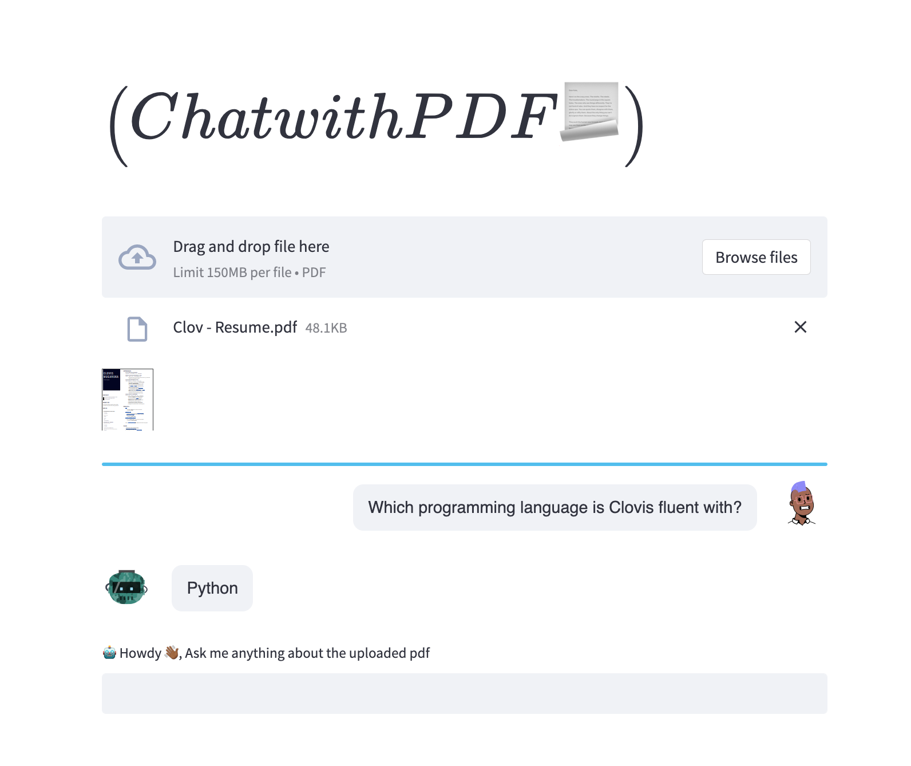

# Chat with PDF (or any other document)



 This is still very much a work in progress, meaning it ain't production-ready 
 (and to be fair to myself, it was a good excuse to try out ChatGPT 😃).
 
## Usage
Make a copy of [.env.dev](.env.dev) file named `.env`, 
and make sure all the **ENVIRONMENT_VARIABLES** are set - of importance, 
the **OPENAI_API_KEY** must be present and set.

```bash
cp .env.dev .env  # make a copy of .env.dev called .env
```

### Development (for now 😂)

Prerequisites:

- [Python](https://www.python.org/downloads/release/python-3112/)
- [Pipenv](https://pipenv.pypa.io/en/latest/)
- [Git](https://git-scm.com/)
- Obtain an [OpenAI API Key](https://platform.openai.com/account/api-keys)

With [Docker](https://www.docker.com/):

Make sure you have both [docker](https://www.docker.com/) and
[docker-compose](https://docs.docker.com/compose/) installed locally.

```bash
docker-compose -f .devops/docker-compose.yml up --build
````

Without [Docker](https://www.docker.com/):

```bash
$ git clone https://github.com/clovisphere/chat-with-pdf.git  # clone the repo
$ cd chat-with-pdf  # cd into project root
$ pipenv install # install dependencies
$ pipenv shell  # activate virtualenv
$ python -m streamlit run app.py # or streamlit run app.py
```

If all went well, your app should be available on [http://127.0.0.1:8501](http://127.0.0.1:8501)


## Author

Clovis Mugaruka

- [github.com/clovisphere](https://github.com/clovisphere)
- [twitter/clovisphere](https://twitter.com/clovisphere)

## License

Copyright ©️ 2023, [Clovis Mugaruka](https://clovisphere.com).\
Released under the [MIT License](LICENSE).
